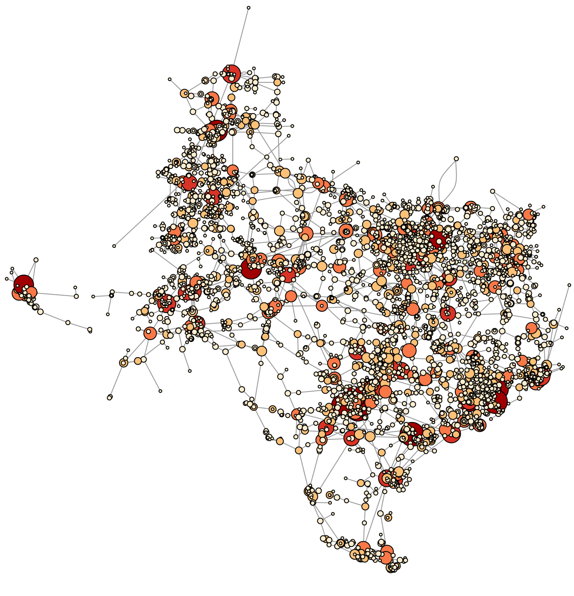

# Using GNAR models for congestion costs in ERCOT

<h3 align="center">Using network autoregressive models to predict nodal congestion costs in the ERCOT electrical grid</h3>
<!-- PROJECT LOGO -->
 

  

This project was carried out in collaboration with [Aurora Energy Research](https://auroraer.com/).

<!-- ABOUT THE PROJECT -->
## About The Project

Codebase for Clara Berger's MSc Dissertation at University of Oxford: Using network autoregressive models to predict nodal congestion costs in the ERCOT electrical grid

Abstract: 
Nodal pricing models require that energy prices be modelled at a number of interacting nodes simultaneously. In this report, we model the congestion cost component of energy prices at various nodes in the Electric Reliability Council of Texas (ERCOT) grid. We utilise Generalised Network Autoregressive (GNAR) models to constrain the interactions between various nodes based on network structure. Our method contributes a novel approach in electricity price modelling by employing an autoregressive model at the nodal level that incorporates grid structure. The models perform well in fitting the nodal historical congestion cost data, but display limited forecasting capabilities when predicting more than one hour in the future. Assuming the edges are present a priori leads to a robust method of dimension reduction for Vector Autoregressive modelling, but limits us to only modelling between 8 and 59 nodes at a time. Overall, incorporating neighbour effects improves the models’ prediction capabilities over a univariate AR model for 11 out of 16 combinations of time series and network structure.

<!-- GETTING STARTED -->
## Getting Started

Key packages required:
R:
* `GNAR`  
* `igraph`
* `xts`

Python:
* `geopandas`
* `pandas`

(<a href="#readme-top">back to top</a>)

<!-- ROADMAP -->
## Contents

### code
  - `run_get_grid_geometry.py` python file for constructing the electric grid of Texas using public data, find all node locations to create an adjacency matrix as well merge nodes from the public data with those from Aurora
  - `get_grid_geometry.py` python file containing the functions for `run_get_grid_geometry.py`

  - `GNAR.R` R file that creates a network, manipulates the historical congestion cost data, fits the GNAR model, assess model performance, and forecasts future congestion costs based on the fit model
  - `run_GNAR.R` R file containing the functions for `run_get_grid_geometry.py`
    
  - `network_statistics.R` R file that creates an `igraph` network for the Texas electric grid and then extracts key network statistics

### network_comp
  - `network_comparison.R` R file that compares the networks created using public data and the actual electric grid of Texas

### grid_shape
  - `us_grid.shp` shapefile from the feature layer U.S. Electric Power Transmission Lines based on data from Homeland Infrastructure Foundation-Level Data (HIFLD) [U.S. Electric Power Transmission Lines](https://www.arcgis.com/home/item.html?id=d4090758322c4d32a4cd002ffaa0aa12&view=list&sortOrder=desc&sortField=defaultFSOrder)

### cb_2022_us_state_5m
  - `cb_2022_us_state_5m.shp` shapefile of US states from [US Census TIGER API](https://www.census.gov/geographies/mapping-files/time-series/geo/cartographic-boundary.html) used to cut out the transmission lines in Texas

### figures
  - `tx_network_.png` figure of the network created from the Texas elextric grid with transmission lines as edges based on public data

(<a href="#readme-top">back to top</a>)

<!-- CONTACT -->
## Contact

Clara Berger 
Email: cberger4@wellesley.edu 
Github: [https://github.com/claraberger0](https://github.com/claraberger0)

(<a href="#readme-top">back to top</a>)

<!--
-->

  

